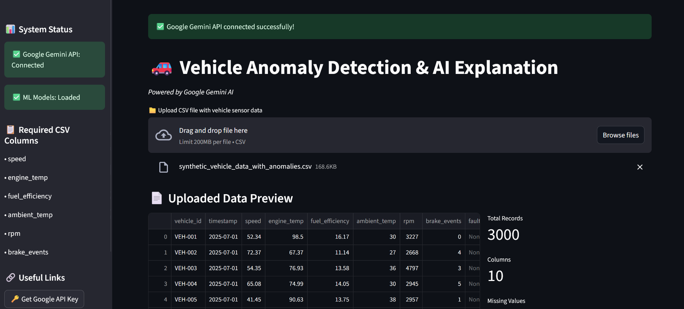
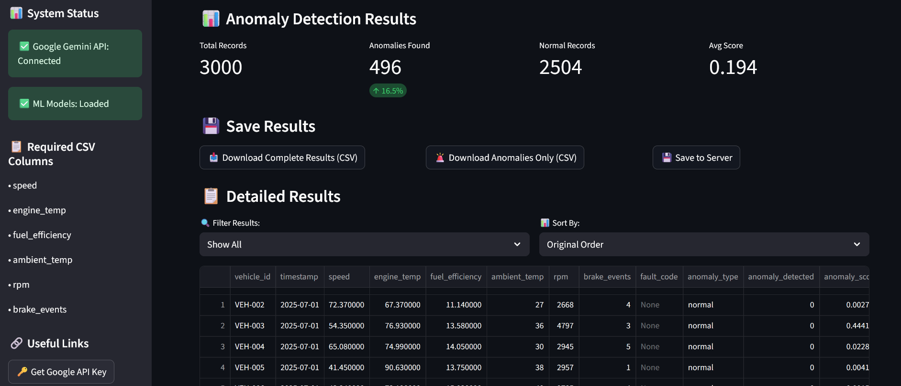
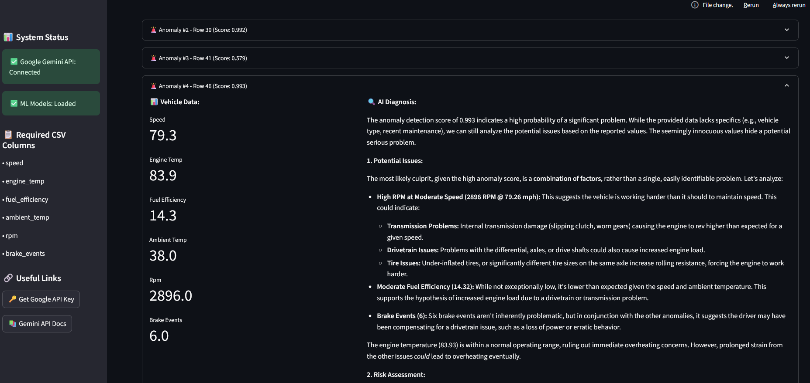

# 🚗 Vehicle Anomaly Detection & GenAI Explanation

A Streamlit-based app for detecting anomalies in vehicle sensor data using a deep learning model, and explaining them with Google Gemini AI.

---

## 📌 Overview

This project provides a complete pipeline for:

- Uploading vehicle telemetry data (CSV)
- Detecting anomalies using a trained model
- Scaling features with a trained scaler
- Explaining each anomaly using Google Gemini
- Visualizing results directly in a web app

---

## 📊 Dashboard Preview

### 🔸 Upload Data

Upload CSV and preview raw vehicle telemetry.



---

### 🔸 Anomaly Detection Results

Detected anomalies with their status and scores.



---

### 🔸 Gemini AI Explanations

For each anomaly, the app gives a smart explanation using Gemini.



---

## 🧪 Model Training & EDA

- 🔍 EDA in `eda.ipynb`  
- 🧠 Model trained in `deep_learning_model.ipynb`

Features used:

```
speed, engine_temp, fuel_efficiency, ambient_temp, rpm, brake_events
```

Model outputs include:

- `anomaly_detected`
- `anomaly_score`
- `anomaly_type`

---

## ⚙️ Installation & Setup

```bash
# 1. Clone the repo
git clone https://github.com/yourusername/vehicle-anomaly-detector.git
cd vehicle-anomaly-detector

# 2. Create virtual environment (optional)
python -m venv anomalyenv
source anomalyenv/bin/activate  # or anomalyenv\Scripts\activate on Windows

# 3. Install dependencies
pip install -r requirements.txt
```

---

## 🚀 Run the App

```bash
streamlit run app.py
```

---

## 📁 File Structure

```
📦 vehicle-anomaly-detector
├── app.py
├── eda.ipynb
├── deep_learning_model.ipynb
├── requirements.txt
├── screenshots/
│   ├── upload_preview.png
│   ├── detection_results.png
│   └── explanation_section.png
├── notebooks/
│   ├── anomaly_model.pkl
│   └── scaler.pkl
├── data/
│   └── synthetic_vehicle_data_with_anomalies.csv
|   └── synthetic_data.py
|   └── vehicle_anomaly_results_20250727_160516.csv
```

---

## 🔐 Google Gemini API Key

To enable AI explanations, [get your Gemini API key](https://makersuite.google.com/) and add it to your `.env` file:

```
GOOGLE_API_KEY=your_key_here
```

---

## 📦 Requirements

See `requirements.txt` — you can create it using:

```bash
pip freeze > requirements.txt
```

---

## 🧰 Tech Stack

- Python 3.10
- Streamlit
- TensorFlow / Keras
- Gemini API (via LangChain)
- Pandas, NumPy, Matplotlib

---

## 📄 License

This project is licensed under the MIT License.

---

## 🙌 Acknowledgments

- [Google Gemini](https://deepmind.google)
- [Streamlit](https://streamlit.io/)
- OpenAI for support and tech inspiration
